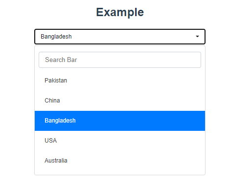

# Vue Select Picker
It's for VueJs developers for rendering selectpicker in components.

### Installation
```npm i vue-select-picker-bootstrap```


### Properties
prop | type | Default | Description
-----|-----|----------|------------
defaultTitle  | String | Nothing Selected | Title as showing default on selectbox.
searchable | Boolean | false | Options search functionality.
disabled  | Boolean | false | For disabling selectbox.
searchPlaceholder  | String | Search | Placeholder on search text field.
searchNotFound | String | No results matched | When option not found after search.
addClass | String | null | Add extra class for style or any other purpose if needed.

### Basic Example Code: 
```
<template>
    <VSelect
          v-model="selected"
          :options="countries"
        />
</template>
```
```
<script>
import VSelect from "@/vue-select-picker-bootstrap";
export default {
  name: "App",
  components: {
    VSelect
  },
  data() {
    return {
      countries: [
        { value: 1, text: "Pakistan" },
        { value: 2, text: "China" },
        { value: 3, text: "Bangladesh" },
        { value: 4, text: "USA" },
        { value: 5, text: "Australia" },
      ],
      selected: {value: null},
    };
  }
};
</script>
```
For Default Selection:
Example (Bangladesh will be default selected)
```
export default {
  name: "App",
  components: {
    VSelect
  },
  data() {
    return {
      countries: [
        { value: 1, text: "Pakistan" },
        { value: 2, text: "China" },
        { value: 3, text: "Bangladesh" },
        { value: 4, text: "USA" },
        { value: 5, text: "Australia" },
      ],
      selected: {value: 3},
    };
  }
};
```

### Html is supported in items text for passing icon/images or something related to html.
### Example:
```
<script>
import VSelect from "@/vue-select-picker-bootstrap";
export default {
  name: "App",
  components: {
    VSelect
  },
  data() {
    return {
      stateOptions: [
        { value: 1, text: "<i class='fa fa-circle' style='color:green;'></i> Enable" },
        { value: 0, text: "<i class='fa fa-circle' style='color:red;'></i> Disabled" },
      ],
      selected: {value: 0},
    };
  }
};
</script>
```


